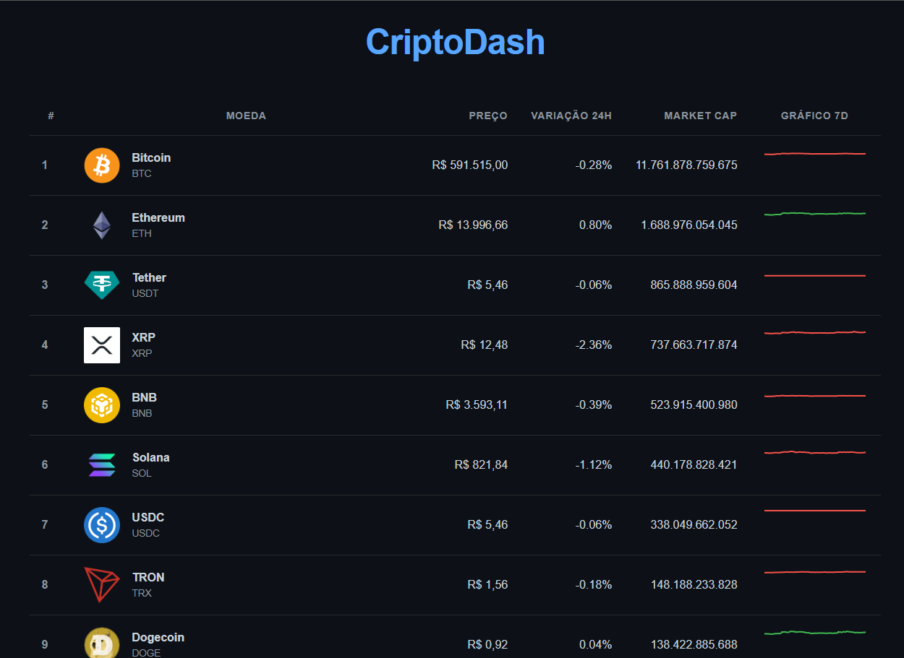

#  CriptoDash 1.0

> Um dashboard interativo e responsivo para visualização de dados de criptomoedas, construído com React e Recharts. Este projeto foi desenvolvido como uma peça central de portfólio para demonstrar habilidades em arquitetura de front-end, UI/UX design e consumo de APIs.

**🚀 [Acesse a versão ao vivo aqui!](https://cripto-dash-gold.vercel.app/)**



---

## 💡 Sobre o Projeto

O CriptoDash 2.0 foi criado com o desafio de apresentar uma grande quantidade de dados de forma clara e intuitiva em qualquer dispositivo. O principal destaque técnico é a sua tabela de dados, que se transforma de forma inteligente em uma lista de cards em telas menores, garantindo uma experiência de usuário impecável no mobile.

## ✨ Funcionalidades

* **Tabela de Dados Responsiva:** Uma tabela completa no desktop que se converte em uma lista de cards no mobile.
* **Visualização de Dados:** Mini-gráficos (Sparklines) de 7 dias para cada moeda, utilizando a biblioteca `Recharts`.
* **Carregamento Otimizado:** Interface com "Skeleton Loading" para uma melhor percepção de performance durante a busca de dados.
* **Dados em Tempo Real:** Consumo da API da CoinGecko para obter os dados mais recentes do mercado.

## 🛠️ Tecnologias Utilizadas

* **Front-End:** React, Vite
* **Visualização de Dados:** Recharts
* **Estilização:** CSS Puro com Variáveis e Media Queries
* **Hospedagem:** Vercel

## ⚙️ Como Executar Localmente

```bash
# Clone o repositório
$ git clone [https://github.com/davieduard0x01/CriptoDash.git](https://github.com/davieduard0x01/CriptoDash.git)

# Instale as dependências
$ npm install

# Inicie o servidor
$ npm run dev
